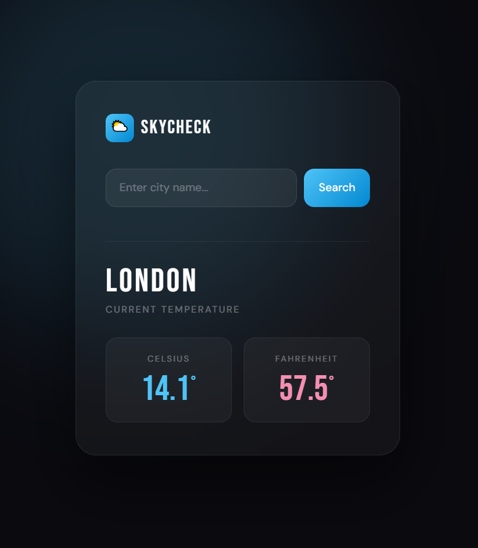
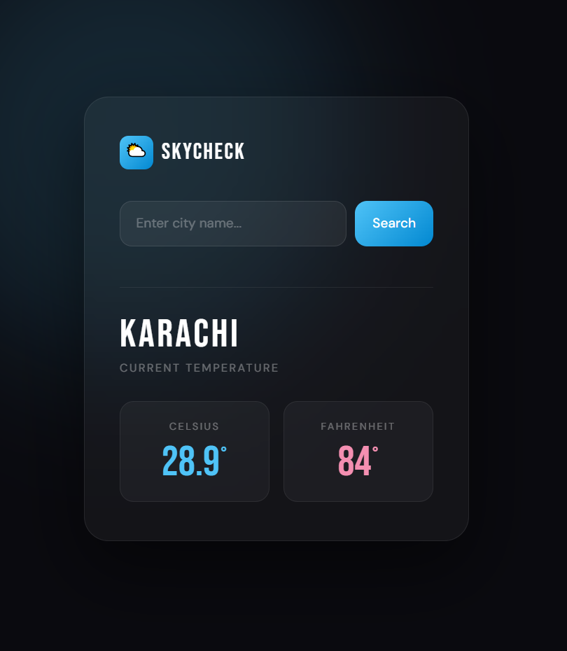

# 🌤️ Weather App

## 📋 Features
🔍 City-Based Search  
🌡️ Temperature in Celsius & Fahrenheit  
⚡ Real-Time Data via OpenWeatherMap API  
❌ Error Handling for Invalid Cities  

## 🖼️ Screenshots

### 🏠 Home Page

### 🌡️ Weather Result

## 🛠️ Tech Stack
C# | ASP.NET Core MVC | OpenWeatherMap API | Razor Views | .NET 8
